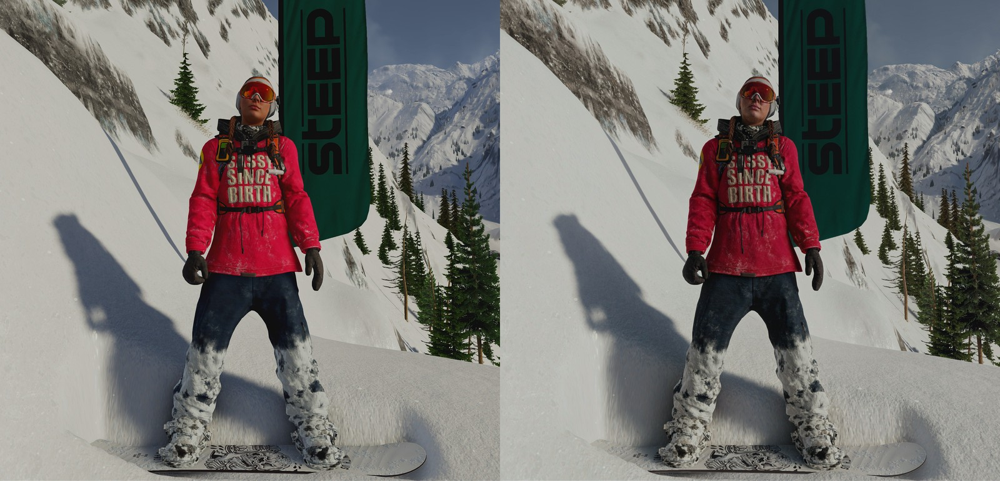

# dlssnr-pytorch

NVIDIA's DLSS 5 neural rendering network ("DLSS-NR") in PyTorch.

The network takes a colour frame and the library's conditioning controls and returns the enhanced frame, reproducing NVIDIA's output for the same input to about 45 to 49 dB PSNR.

```bash
dlssnr extract ./path/to/nvngx_dlssnr.dll -o weights.safetensors
dlssnr run frame.png -o enhanced.png --side-by-side
dlssnr verify --input frame.png --reference nvidia_output.png
```

[](docs/steep-comparison.jpg)

A frame from Steep (input on the left, this network's output with the default controls on the right); click for the full-size image. Steep is a trademark and the game's art is the property of Ubisoft; the screenshot is shown only to illustrate the network's output and is not covered by this project's license.

## Results

The same Tomb Raider (2013) frame at three sizes, fed to this network and to NVIDIA's library with the
default controls, compared as 8-bit RGB (single frames, no history). "Unprocessed" is the input against
NVIDIA's output, for scale. The CPU column and the metrics were measured with the reference arithmetic
(`DLSSNR_TRITON=0` gives the same bits on a GPU: 45.55, 48.21 and 49.05 dB, 0.37, 0.70 and 1.82 s on the
7900 XTX); the GPU column is the Triton kernels described under [Speed](#speed), steady state after the first frame.

| Frame | PSNR vs NVIDIA | SSIM vs NVIDIA | Edit correlation | Unprocessed PSNR | 16 CPU threads | RX 7900 XTX (ROCm) |
| --- | --- | --- | --- | --- | --- | --- |
| 1920x1080 | 45.70 dB | 0.9961 | 0.9947 | 26.44 dB | 21 s | 0.19 s |
| 2560x1440 | 48.26 dB | 0.9968 | 0.9956 | 27.72 dB | 40 s | 0.33 s |
| 3840x2160 | 49.10 dB | 0.9970 | 0.9955 | 28.69 dB | 90 s | 0.77 s |

The timings are not a focus of this project and do not represent what a GPU can do with this network. This is a
reference implementation in PyTorch, written to reproduce NVIDIA's output, not to be fast. A dedicated Vulkan port,
[DLSSNR-RDNA3](https://github.com/mauri870/DLSSNR-RDNA3), runs the same network at 4K in 59 ms on the same
7900 XTX.

"Edit correlation" measures how closely this network's changes match NVIDIA's. NVIDIA's output is identical across runs, so the remaining differences come from arithmetic: the network rounds to 8-bit floating point after most operations, and summation order can shift values near rounding boundaries. Against an independent implementation, it matches 97–100% of each layer's output exactly and is within one 8-bit step on nearly all other elements; the widest Swin layers and pre-block have the lowest exact-match rates.

## Setup

Python 3.11 or newer and [uv](https://docs.astral.sh/uv/). Pick the PyTorch build for your hardware:

```
uv sync --extra rocm    # Radeon RX 7000/9000, Instinct (ROCm 7.2 wheels)
uv sync --extra cuda    # NVIDIA (CUDA 13.0 wheels)
uv sync --extra cpu     # no GPU
```

`--device auto` (the default) uses the GPU when PyTorch sees one and the CPU otherwise; `cpu`, `cuda` and
`cuda:N` force a choice (ROCm builds also report `cuda`). The GPU results above were measured on a
7900 XTX with ROCm; the CUDA build runs the same code and has not been tried on an NVIDIA card.
GPU memory at 1080p, 1440p and 4K peaks at 1.7, 2.6 and 5.0 GiB (2.6, 4.3 and 8.8 GiB with the reference arithmetic).

## Speed

On an AMD GPU (the ROCm build) the layers that dominate the time run as Triton kernels (`dlssnr/gemm.py`,
`attention.py`, `swin_fused.py`; Triton ships with the ROCm PyTorch wheel). The CUDA build and the CPU use the
reference arithmetic:

- every matrix product reads its e4m3 operands as float16 (exact) on the matrix units with a float32
  accumulator, and the activation and the rounding to e4m3 are done in the kernel's epilogue;
- the window attention of the Swin blocks and the global attention of the vision-transformer blocks are one
  kernel each, with the rounding points and the float16 summation orders of the reference;
- the whole body of the single-head 32-channel Swin blocks (the pre-block, the post-block and the layers at
  full and half resolution) is one kernel per attention window, so its feature map is read and written once.

The float32 sums inside the matrix products are taken in the matrix unit's order instead of the reference's,
so a fraction of a percent of the values in a layer land one e4m3 step away, and the difference accumulates
over the 152 layers. Against NVIDIA's output the three frames score within 0.15 dB of the reference
arithmetic (0.15, 0.05 and 0.05 dB higher), which is rounding noise, not a gain. `DLSSNR_TRITON=0` runs the reference arithmetic
(elementwise PyTorch and float32 matrix products); the CPU always does. The first frame also compiles the
kernels (about 4 s, cached on disk afterwards).

On a 7900 XTX at 1080p, the 8 layers at 32 channels, the pre-block and the post-block went from 180 ms to 32 ms, the vision-transformer
attention from 35 to 8 ms, and the frame from 372 to about 190 ms. The multi-head Swin layers (64 to 256
channels, about 100 ms at 1080p) still run as unfused PyTorch operations plus the Triton matrix products and
attention; a one-kernel-per-window version of them was tried and was not faster.

## Getting the weights

`nvngx_dlssnr.dll` is NVIDIA's Neural Rendering library, shipped inside NVIDIA's DLSS 5 / NGX packages. The
extractor reads bytes from it (it never loads or runs the library) and accepts either the DLL or a zip that
contains it:

```
dlssnr extract nvngx_dlssnr.dll -o weights.safetensors        # about a second, 141 MB
```

## Running it

```bash
dlssnr run frame.png -o enhanced.png                 # enhance an image
dlssnr run frame.png --side-by-side                  # the input and the result in one picture
dlssnr run frame.png --intensity 1.5 --style 0 --local-tone 1 --local-structure 1 --skin-structure -1
dlssnr verify --input frame.png --reference nvidia.png -o ours.png --min-psnr 44
dlssnr plan 1920x1080                                # the layers of the network for a frame size
dlssnr benchmark --size 3840x2160 --all              # time a frame; --layers and --stages show where it goes
```

Frames of any size work: the network pads them to the extent it needs and crops the result. `verify` prints
the PSNR and SSIM against the reference, the RMS error, how many pixels are within one 8-bit step, and how
well the edit matches; `--min-psnr` makes it exit non-zero below a threshold, for scripts.

From Python:

```python
from dlssnr.io import Controls, load_image, save_image
from dlssnr.model import NRNet
from dlssnr.weights import Weights

frame = load_image("frame.png")                         # uint8 [height, width, 3]
net = NRNet(Weights.load("weights.safetensors"), frame.shape[1], frame.shape[0])
enhanced = net(frame, Controls(intensity=1.0))          # uint8 [height, width, 3]
save_image("enhanced.png", enhanced)
```

`Controls` has the controls the real library takes, with the defaults NVIDIA's reference frames were made
with: `intensity` 1.0, `style` 0, `local_tone` 1.0, `local_structure` 1.0, `skin_structure` -1.0, `auto_mask`
true. `depth`, `motion`, `history` and `reset` are accepted so that calling code can match the library's
interface, and are ignored: this version computes single frames (every frame as the first frame of a
sequence). `net(frame, controls, capture=True)` also returns every layer's output.

## The network

71 blocks, 152 layers, 141 MB of FP8 weights, in a U-Net shape. A frame is padded to a multiple of what its
halvings need; sizes below are for 1920x1080.

| Blocks | Layers | Resolution | Channels |
| --- | --- | --- | --- |
| 0 | pre-block: the frame lifted to features with seeded noise and the conditioning, one Swin layer, 2x2 pool | 1088x1920 to 544x960 | 3 to 32 |
| 1-4 | fused Swin layers, 1 head, windowed attention + MLP; the last pools and widens | 544x960 | 32 to 64 |
| 5-8 | Swin layers, 2 heads | 272x480 | 64 to 128 |
| 9-14 | Swin layers, 4 heads | 136x240 | 128 to 256 |
| 15-22 | Swin layers, 8 heads | 68x120 | 256 to 512 |
| 23-30 | "split Swin" blocks: grouped feed-forward, projection, 16-head shifted-window attention, projection; the last pools | 36x60 | 512 to 1024 |
| 31-38 | vision-transformer blocks: global attention over all tokens, 4x feed-forward | 20x32 | 1024 |
| 39 | decoder input: project to 512 and upsample, merged with the skip from block 30 | 36x60 | 1024 to 512 |
| 40-47 | split Swin blocks again | 36x60 | 512 |
| 48-69 | Swin layers mirroring the encoder, each level starting with an upsample merged with that level's skip | 68x120 up to 544x960 | 512 down to 32 |
| 70 | post-block: features to 3 channels, blended with the frame by the intensity | 1088x1920 | 32 to 3 |

Numerics follow the library, because the weights were trained and calibrated for them. Tensors are float32
that lie exactly on the FP8 e4m3 grid (`dlssnr.quant.q8` rounds to nearest even and saturates at 448, which is
PyTorch's `float8_e4m3fn` cast after a clamp); an e4m3 product has at most 8 significant bits, so products
are exact and accumulation is float32. Where the library keeps FP16 intermediates (activations, softmax
sums, the attention exponential, residual gains) the layer rounds through FP16 at the same points. The
activation is a cubic SiLU, q and k are normalised per head with per-head scales, and the position bias is
baked into the exponent.

## Limits

- Single frames only. NVIDIA's library blends in the previous frame's output through history features and
  motion vectors; those inputs are accepted and not used.
- Not bit-identical to NVIDIA's output (see Results), and the noise the library adds is reproduced from its
  generator for one fixed seed.
- Intensity above 1 uses the library's luminance-ratio form; it has not been compared against the library.
- Speed: 0.2 to 0.8 seconds a frame from 1080p to 4K on a 7900 XTX, 20 to 90 seconds on 16 CPU cores. The
  FP8 rounding is emulated, and the layers outside the fused kernels still run as separate PyTorch
  operations.
- The Triton kernels have only been run on the 7900 XTX (ROCm). They use an AMD instruction, so the CUDA build
  stays on the reference arithmetic.
- The layouts of the weight file were worked out from the library by inspection; a different version of
  `nvngx_dlssnr.dll` than the one this was built against may not extract.

The code is under the MIT license (see `LICENSE`); the network's weights are NVIDIA's and are not covered by it.

This is an independent project. It is not affiliated with, endorsed by, or supported by NVIDIA. DLSS is a
trademark of NVIDIA Corporation. The network's weights are NVIDIA's.
